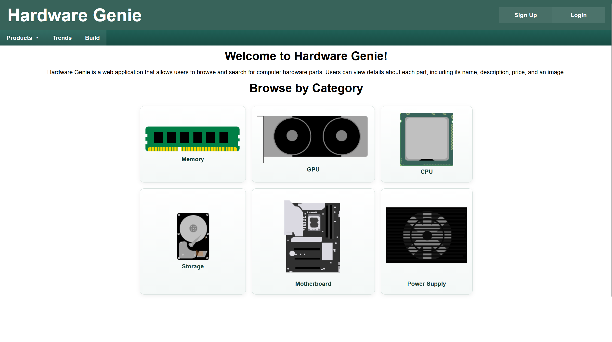

# Hardware-Genie
Hardware Genie is a website that aims to provide up to date PC price information, make inferences about the future prices of components, and compare values of parts within a category. It gathers information via webscraping, and uses sentiment analysis to interpret headlines to predict whether the prices are expected to greatly change soon. We help estimate the value of a product by comparing certain specs of a component, like clock speed in RAM, and gives it a rating based on that. 



# Building and running the project
To build and run the project, you can use the following commands:
Requires Docker to be installed on your machine.
```powershell
# Build the project
docker build -t hardware-genie .
# Run the project
docker run -p 5000:5000 hardware-genie
```
This loads the project on localhost:5000, and you can access it through your web browser.

Scraper functionality needs a redis server and a celery worker to run. You can start these with the following commands:
```powershell
# Start redis server
docker run -p 6379:6379 redis
# Start celery worker
$env:PYTHONPATH = 'src'
celery -A app.tasks.celery worker --pool=solo --loglevel=info
```
After running the celery worker, you can trigger scrapers from the Scrapers page on the website.
This requires an admin user to use. Create a user by filling out the Sign Up form. You can then make that user an admin by running the following scritp from the project root:

```powershell
cd src/app
python make_admin.py --email "<email_of_user_to_make_admin>"
```
With an admin user, you can access the Scrapers page and trigger scrapers to run. You can also access the Value Analysis page, which allows recalculating the category's value rating when adding new products. 

# Running the project on AWS 
Build + run one-time seed:
```powershell
Set-Location "c:\Users\manam\Desktop\4360 cs Senior Experience\Hardware-Genie"
.\scripts\terraform-build.ps1 -DbPassword "greatpassword" -SeedAfterBuild
```
More commands in the [REBUILD_CHECKLIST.md](REBUILD_CHECKLIST.md) file

# Model used for Sentiment analysis
https://huggingface.co/mrm8488/distilroberta-finetuned-financial-news-sentiment-analysis/discussions
